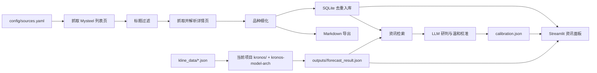

# zixun 项目交接文档

> 用途：供后续 Codex 会话、开发者或其他接手者快速理解项目、恢复运行环境并继续工作。
>
> 最后验证时间：2026-08-17
>
> 当前项目根目录：`/Users/eurus/Code/zixun`

## 1. 项目概览

`zixun` 是一个面向黑色系商品的现货资讯抓取、存储、浏览和预测辅助系统，主要关注：

- 螺纹钢（`rebar`）
- 铁矿石（`ironore`）
- 焦煤（`cokingcoal`）
- 焦炭（`coke`）

项目从 Mysteel 抓取日报/早报、周报、库存产量、供需快讯和趋势研判等现货基本面资讯，经过标题过滤和详情解析后写入 SQLite，并同时导出为 Markdown，最后通过 Streamlit 面板浏览。

项目还提供一条独立的预测后处理链路：读取 K 线数据，调用 Kronos 生成未来三个交易日的预测，再从资讯库检索相关资讯，交给 OpenAI 协议兼容的 LLM 做研判和温和数值校准。

### 业务边界

- 重点是现货基本面资讯，不主动抓取预测端已有的期货价格类栏目。
- Mysteel 文章中的 AI 摘要是重要数据源；正文过短时会用 AI 摘要作为正文兜底。
- 资讯校准是 Kronos 预测的后处理，不修改 Kronos 模型本身。
- 校准只允许温和调整：单日上涨概率最多偏移 `±0.10`，单日收益率最多偏移 `±0.015`。

## 2. 核心数据流



### 资讯抓取链路

1. `config/sources.yaml` 定义栏目、品种、URL 模板、报告类型和抓取优先级。
2. `zixun.fetcher.Fetcher` 以单线程、真实浏览器 UA、随机间隔和指数退避抓取列表页及详情页。
3. `zixun.filters.evaluate()` 依次处理总开关、排除词、地区过滤和 analysis 栏目白名单。
4. `zixun.parser` 解析文章 URL、标题、发布时间、AI 摘要、正文和来源。
5. `zixun.classifier.refine_variety()` 根据标题将栏目默认品种收窄到更具体的品种。
6. `zixun.storage` 以 URL 的 MD5 作为唯一去重键写入 `data/zixun.db`，新文章同时导出到 `articles/`。

### 预测与资讯校准链路

1. `kline_data/kline_*.json` 是供应商 K 线 JSON，包含 `Ins` 和 `data`。
2. 面板或手动命令调用当前项目的 `kronos.prediction_3day_json`，由已安装的 `kronos-model-arch` 提供 `model` 包，模型权重从 Hugging Face 缓存加载，生成 `forecast_result.json`、`metrics.json`、`forecast_paths.csv` 和 `forecast_plot.png`。
3. `calibration.forecast_loader` 读取预测文件，提取合约、预测起点、未来三日、上涨概率和预测收益率。
4. `calibration.instrument_mapping` 将合约前缀映射到资讯品种：`i→ironore`、`rb→rebar`、`j→coke`、`jm→cokingcoal`。
5. `calibration.article_retrieval` 从 SQLite 检索预测起点前的相关资讯，默认回看 3 天、最多 15 条；目标品种无资讯时可回退到黑色系通用资讯。
6. `calibration.llm_client` 通过 OpenAI 协议调用配置的 LLM，要求返回 JSON。
7. `calibration.calibration_engine` 校验结构并裁剪偏移边界，`output_writer` 写出 `calibration.json`。

## 3. 目录说明

```text
.
├── README.md                         # 面向使用者的快速说明
├── HANDOFF.md                        # 本文档，跨会话交接入口
├── requirements.txt                  # Python 依赖
├── .env.example                      # 本机运行配置模板；真实 .env 不提交
├── config/
│   ├── sources.yaml                  # Mysteel 栏目、品种、URL 和优先级
│   ├── filters.yaml                  # 排除词、地区词、全局词和白名单
│   └── calibration.yaml              # 兼容旧调用的可选校准基础配置
├── zixun/                            # 主应用：抓取、存储、面板和后台任务
├── calibration/                      # 预测结果的资讯检索与 LLM 校准
├── kronos/                           # 本地独立 Kronos 三日预测实现/入口
├── scripts/
│   └── run.sh                        # cron 调用的抓取入口
├── data/                             # SQLite 数据库和后台任务状态
├── articles/                         # 抓取文章的 Markdown 导出
├── kline_data/                       # 供应商 K 线 JSON 输入
├── outputs/                          # 每个合约的预测和校准产物
└── logs/                             # 抓取和预测日志
```

### `zixun/` 主应用模块

| 文件 | 职责 |
|---|---|
| `settings.py` | 从 `.env` 加载项目路径、数据库、日志、K 线、输出目录、Python 解释器、设备和模型缓存；也定义面板显示名称。 |
| `fetcher.py` | HTTP Session、UA、超时、随机礼貌延迟和指数退避重试。 |
| `parser.py` | Mysteel 列表页和详情页解析；提取标题、发布时间、AI 摘要、正文和来源。 |
| `classifier.py` | 标题黑名单、analysis 相关词和品种标题关键词。 |
| `filters.py` | 加载/保存 `filters.yaml`，执行排除词、地区词、全局词和白名单规则。 |
| `pipeline.py` | 抓取主流程：读配置、抓列表、过滤、抓详情、分类、去重、入库和 Markdown 导出。 |
| `storage.py` | SQLite 建表、连接、URL 哈希、文章写入和 Markdown 导出。 |
| `queries.py` | 面板使用的文章列表、按日统计、品种统计、数量统计和详情查询。 |
| `cli.py` | `python -m zixun.cli` 命令行入口，支持初始化、抓取和回填。 |
| `runner.py` | 面板触发的后台抓取执行器；写入 `data/run.status.json`，日志写入 `logs/panel-run.log`。 |
| `cron.py` | 只管理带 `# zixun-cron` 标记的 crontab 条目。 |
| `dashboard.py` | Streamlit 主面板：资讯筛选、统计、详情、抓取管理、cron 管理和预测区块。 |
| `forecast_runner.py` | 面板触发的预测+校准后台执行器；串行调用本地 `kronos.prediction_3day_json` 和 `calibration`。 |
| `forecast_dashboard.py` | 预测产物、三日图、原始/校准数据、LLM 研判和来源资讯的展示。 |

### `calibration/` 校准模块

| 文件 | 职责 |
|---|---|
| `__main__.py` | `python -m calibration` 入口。 |
| `cli.py` | 校准命令行参数、异常降级、退出码和整体编排。 |
| `config.py` | 读取 `.env` 中的 `CALIBRATION_*`；可选兼容 `config/calibration.yaml`，再合并 CLI 参数。 |
| `forecast_loader.py` | 加载并校验 Kronos 的 `forecast_result.json`。 |
| `instrument_mapping.py` | 合约前缀与资讯品种之间的映射。 |
| `article_retrieval.py` | 从 SQLite 读取、过滤、排序并截断资讯。 |
| `prompt_builder.py` | 构造 LLM system/user 消息和 JSON 输出契约。 |
| `llm_client.py` | OpenAI 协议客户端、JSON 宽松解析和可重试错误处理。 |
| `calibration_engine.py` | 校验 LLM 返回结构，应用偏移上限和绝对值裁剪。 |
| `output_writer.py` | 生成并写入 `calibration.json`，保留来源资讯元数据。 |
| `fixtures/` | 预测输入 fixture，当前包含 `forecast_backtest_i2609.json`。 |

### `kronos/` 本地预测代码

- `three_day_json_forecast.py`：独立的三交易日预测实现，负责供应商 JSON 解析、K 线校验、异常交易日清理、模型采样、基线比较、指标和图表产出。
- `prediction_3day_json.py`：命令行包装入口。

注意：当前 Streamlit 面板的 `zixun.forecast_runner` 调用的是本目录下的
`kronos/prediction_3day_json.py` 模块入口，不依赖 Kronos 源码目录；运行环境只需安装
`kronos-model-arch`，并配置模型权重缓存。

兼容性注意：`kronos-model-arch==0.1.0` 的公开
`auto_regressive_inference()` 会先把 `sample_count` 条路径求均值，不返回原始路径。
`kronos/three_day_json_forecast.py` 会检测这一接口并逐次请求单条路径，以保留本项目的
概率、分位数和 `sample_paths` 产物契约；因此默认采样数较大时推理会比向量化实现慢。

### 运行数据目录

| 目录 | 内容和注意事项 |
|---|---|
| `data/` | `zixun.db`、`run.status.json`、`forecast.status.json`。状态文件由后台任务覆盖写入。 |
| `articles/` | `articles/<primary_variety>/<YYYY-MM-DD>/<url_tail>.md`。由成功入库的文章生成。 |
| `kline_data/` | `kline_*.json` 输入文件；空或无效数据的合约不会出现在面板选择列表。 |
| `outputs/` | `outputs/<contract>/` 下保存预测和校准产物，可直接被面板读取。 |
| `logs/` | `panel-run.log`、`forecast.log`，以及 cron 使用的 `cron.log`。 |

这些目录包含运行时数据，不应在普通代码修改中手工重写或清空。数据库和预测产物应先确认是否需要保留，再进行清理或重算。

## 4. 环境与启动

### 推荐 Python 环境

项目依赖 Python 3.10+；跨会话开发和维护统一优先使用 Python 3.12 虚拟环境：

```bash
cd /Users/eurus/Code/zixun
python3.12 -m venv .venv
source .venv/bin/activate
python -m pip install -r requirements.txt
```

当前机器检查结果：

- Python 3.12：`/opt/homebrew/bin/python3.12`
- 当前项目已建立 `.venv`，解释器为 `/Users/eurus/Code/zixun/.venv/bin/python`，版本为 Python 3.12.13。
- `requirements.txt` 包含 `kronos-model-arch==0.1.0`；该包提供顶层 `model` 导入，项目不需要 Kronos 源码副本。
- `.env`（机器本地、已忽略）控制路径、`KRONOS_PYTHON`、`KRONOS_DEVICE`、`KRONOS_CACHE_DIR`、`KRONOS_LOCAL_FILES_ONLY`、校准参数和 `OPENAI_API_KEY`；模板见 `.env.example`。
- `scripts/run.sh` 会优先使用 shell 中的 `PYTHON` / `ZIXUN_PYTHON`，其次使用项目 `.venv/bin/python`，最后才回退到 `python3`。

### 资讯系统常用命令

以下命令默认已激活项目 Python 3.12 虚拟环境：

```bash
# 初始化 SQLite（幂等）
python -m zixun.cli init

# 只抓取并解析，不写数据库；建议先用来验证栏目和过滤规则
python -m zixun.cli run --dry-run --priority core

# 抓取全部配置栏目
python -m zixun.cli run

# 只抓某个栏目
python -m zixun.cli run --source rebar_daily

# 只抓 core 栏目
python -m zixun.cli run --priority core

# 历史回填，每个栏目翻 N 页
python -m zixun.cli backfill --pages 5

# 打开调试日志
python -m zixun.cli -v run

# 启动 Streamlit 面板，默认 http://localhost:8501
streamlit run zixun/dashboard.py
```

### 过滤规则预览

```bash
python -m zixun.cli run --dry-run --source rebar_daily
```

dry-run 日志会列出被过滤的文章及原因。面板中的“抓取筛选规则”可以修改 `config/filters.yaml`，保存后对后续抓取生效。

### cron 抓取

```bash
# 直接执行一次最新抓取
/Users/eurus/Code/zixun/scripts/run.sh

# 历史回填
/Users/eurus/Code/zixun/scripts/run.sh backfill 5
```

预设 cron 时间为每天 `09:13`、`13:17`、`18:23`，或每天 `08:37`。面板只会增删改带 `# zixun-cron` 标记的条目，不会主动修改其他系统定时任务。

### 手动执行预测和校准

当前入口在项目内；模型实现来自 `kronos-model-arch`，模型权重通过
`KRONOS_CACHE_DIR`（机器相关配置）指向本地 Hugging Face cache。手动执行示例：

```bash
cd /Users/eurus/Code/zixun

KLINE_PATH="kline_data/kline_i2610.json"
OUTPUT_DIR="outputs/i2610"

./.venv/bin/python -m kronos.prediction_3day_json \
  --input "$KLINE_PATH" \
  --output-dir "$OUTPUT_DIR" \
  --device auto

# .env 中配置 OPENAI_API_KEY 后执行校准
./.venv/bin/python -m calibration \
  --input "$OUTPUT_DIR/forecast_result.json"
```

预测的 `lookback`、`sample_count`、`temperature`、`top_p`、`seed` 等算法参数是源码中的手动配置，位于 `kronos/three_day_json_forecast.py` 的 `DEFAULT_*`，也可由 CLI 覆盖；不要把这些参数塞进 `.env`。`zixun.forecast_runner` 在面板点击“一键预测 + 校准”时会自动串行执行上面的两步，并每 5 秒刷新状态和日志。迁移机器时只需重新安装依赖，并配置 Python 解释器、模型缓存和设备。

## 5. 配置说明

### `config/sources.yaml`

每个 `sources` 条目通常包含：

| 字段 | 说明 |
|---|---|
| `id` | 栏目唯一标识，CLI 的 `--source` 使用它。 |
| `variety` | 栏目默认品种列表。 |
| `channel` | Mysteel 频道，如 `jiancai`、`tks`、`coal`、`list1`。 |
| `report_type` | `daily`、`weekly`、`monthly`、`data` 或 `analysis`。 |
| `priority` | `core` 或 `optional`。 |
| `list_url` | 列表页 URL 模板，必须包含 `{page}`。 |
| `max_pages` | 默认抓取页数。 |
| `is_datas` | 标记数据栏目；当前解析逻辑与普通详情页相同。 |

全局 `title_blacklist` 对所有栏目生效。新增栏目通常只需要追加配置，不需要修改抓取主流程。期货价格类栏目目前按项目边界排除。

### `config/filters.yaml`

筛选顺序：

1. `enabled: false` 时全部保留。
2. 标题命中 `exclude_keywords` 时丢弃。
3. 启用 `drop_regional` 时，标题含 `regional_keywords` 且不含 `global_keywords` 时丢弃。
4. 对 `report_type: analysis` 的栏目，标题还必须命中 `include_keywords`。
5. 其他文章保留。

例如，“全国建筑钢材早报”因为含全局词可保留，“山东建筑钢材早报”通常会被地区过滤丢弃。

### `.env` 与 `config/calibration.yaml`

运行时配置默认从根目录 `.env` 读取，模板见 `.env.example`。主要变量包括：

- 路径：`ZIXUN_*`（配置文件、数据、文章、日志、K 线和输出目录）。
- Kronos 环境：`KRONOS_PYTHON`、`KRONOS_DEVICE`、`KRONOS_CACHE_DIR`、`KRONOS_LOCAL_FILES_ONLY`。
- 资讯检索：`CALIBRATION_LOOKBACK_DAYS`、`CALIBRATION_MAX_ARTICLES`、`CALIBRATION_FALLBACK_TO_BLACK_SECTOR`、`CALIBRATION_AI_SUMMARY_CAP`、`CALIBRATION_PREVIEW_CAP`。
- LLM：`CALIBRATION_BASE_URL`、`CALIBRATION_MODEL`、`CALIBRATION_TEMPERATURE`、`CALIBRATION_MAX_RETRIES`、`CALIBRATION_TIMEOUT_SECONDS`。
- 校准边界：`CALIBRATION_MAX_PROB_SHIFT`、`CALIBRATION_MAX_RETURN_SHIFT`、`CALIBRATION_PROB_CLAMP`、`CALIBRATION_RETURN_CLAMP`。

`config/calibration.yaml` 保留为兼容旧调用的可选基础配置，只有显式传入 `--config` 时使用。预测模型的 `lookback`、`sample_count`、`temperature`、`top_p`、`seed` 等算法/实验参数不放入 `.env`，应手动修改 `kronos/three_day_json_forecast.py` 的 `DEFAULT_*` 或通过 CLI 覆盖。

API key 不写入本文或 YAML，只从 `.env` / 外部环境变量 `OPENAI_API_KEY` 读取：

```bash
OPENAI_API_KEY="<your-api-key>"
```

不要把真实 key 写入 `HANDOFF.md`、配置文件、日志或命令历史。

## 6. 数据契约

### SQLite：`data/zixun.db`

主表为 `articles`，当前结构包括：

| 字段 | 说明 |
|---|---|
| `id` | 自增主键。 |
| `url` | 文章原文 URL。 |
| `url_hash` | URL 的 MD5，唯一约束，用于去重。 |
| `title` | 标题。 |
| `variety` | 逗号分隔的品种编码，如 `rebar` 或 `cokingcoal,coke`。 |
| `report_type` | 报告类型。 |
| `source_channel` | 来源频道。 |
| `source_id` | 对应 `sources.yaml` 的栏目 ID。 |
| `publish_time` | 文章发布时间，通常为 `YYYY-MM-DD HH:MM:SS`；当前不带时区。 |
| `fetched_at` | 抓取入库时间。 |
| `ai_summary` | Mysteel AI 摘要。 |
| `body_text` | 清洗后的正文；正文过短时回退到 AI 摘要。 |
| `priority` | `core` 或 `optional`。 |

主要索引为 `(variety, publish_time)`、`publish_time`、`(report_type, publish_time)` 和 `url_hash`。`publish_time` 是后续按日聚合和与 K 线对齐的关键字段。

### Markdown 文章

成功入库且有发布时间的文章导出到：

```text
articles/<primary_variety>/<YYYY-MM-DD>/<url_tail>.md
```

文件包含标题、品种、报告类型、频道、发布时间、来源、原文 URL、AI 摘要和正文。`primary_variety` 是逗号分隔品种中的第一个品种。

### K 线输入

`kline_data/kline_<contract>.json` 使用供应商 payload 结构，关键字段为：

- `Ins`：合约名称，如 `i2610`、`rb2701`。
- `data`：K 线记录数组。
- 记录中包含 OHLC、成交量、成交额、交易日和时间字段。

预测入口会校验 OHLC 关系、时间递增、成交量/成交额非负，并清理每日 K 线根数不是 5 或 7 的异常交易日。

### 预测产物

每个合约产物位于 `outputs/<contract>/`：

- `forecast_result.json`：输入审计、模型配置、预测起点、目标三日、采样路径和概率/收益率等核心结果。
- `metrics.json`：Kronos 与基线模型的 MAE、RMSE、方向命中、区间覆盖等指标。
- `forecast_paths.csv`：预测路径明细。
- `forecast_plot.png`：三日预测图。
- `calibration.json`：LLM 研判、原始预测、校准预测、实际应用偏移和来源资讯。

## 7. 后台任务、状态和日志

### 抓取任务

- `zixun.runner.start_run()` 使用 `subprocess.Popen` 异步启动 `python -m zixun.cli run`。
- 状态文件：`data/run.status.json`。
- 面板日志：`logs/panel-run.log`。
- 面板每 5 秒轮询状态和日志，不阻塞文章浏览。
- 同一时间只允许一个抓取任务；进程退出后状态会收敛为 `finished`。

### 预测任务

- `zixun.forecast_runner.start_forecast()` 先调用当前项目的 `python -m kronos.prediction_3day_json`，再调用本项目的 `python -m calibration`。
- 启动前会用 `KRONOS_PYTHON` 检查 `from model import Kronos, KronosTokenizer, KronosPredictor`；失败时不会创建后台任务。
- 状态文件：`data/forecast.status.json`。
- 日志：`logs/forecast.log`。
- 预测失败通常先检查 `.venv`、`kronos-model-arch`、`KRONOS_CACHE_DIR`、设备（`mps`/`cpu`）和输入 JSON。

### 当前校准状态的特殊注意事项

`forecast_runner.get_status()` 通过是否存在 `forecast_result.json` 和 `calibration.json` 判断产物状态。因此 `forecast.status.json` 中的 `calibrated: true` 只表示 `calibration.json` 存在，不代表 LLM 调用成功，也不代表数值一定发生了非零调整；必须检查 `calibration.json` 的 `meta.llm_error`、`meta.skipped_reason`、`applied_shift` 和 `sources`。

当前日志显示最近的 `rb2701` 和 `i2610` 任务因未设置 `OPENAI_API_KEY` 而出现：

```text
LLM 配置错误：未设置环境变量 OPENAI_API_KEY
```

这类情况下仍可能生成 `calibration.json`，但文件会记录 `llm_error`，并透传 Kronos 原始值，实际偏移为 0。启用真实资讯校准前，必须让启动 Streamlit、手动命令或 cron 的进程继承 `OPENAI_API_KEY`。

## 8. 当前项目快照

以下数据来自 2026-08-17 的只读检查：

| 项目 | 当前值 |
|---|---|
| SQLite 文章数 | 392 |
| 文章发布时间范围 | 2025-11-25 08:34:02 至 2026-08-14 10:30:00 |
| SQLite 品种分布 | `ironore` 217，`rebar` 175 |
| K 线 JSON 文件 | 36 个 |
| 已有预测目录 | `outputs/i2609`、`outputs/i2610`、`outputs/rb2701` |
| 已有 `forecast_result.json` | 3 个 |
| 已有 `calibration.json` | 3 个；不代表三次 LLM 都成功 |
| 最近一次抓取 | 2026-08-14，`core`，列出 560、筛掉 154、保留 406、新增 130、跳过 276、失败 0 |
| Kronos 模型包 | `kronos-model-arch==0.1.0`，当前项目 `.venv` 已安装 |
| 模型缓存 | `/Users/eurus/Code/kronos/Kronos/csj/artifacts/hf_cache`，机器相关，仅为权重缓存，不是源码依赖 |
| 预测冒烟 | `kline_i2610.json`、CPU、`sample_count=1/2` 均已生成独立临时产物 |
| 项目级测试配置 | 未发现 pytest/ruff/pyproject 等项目级测试或质量配置 |
| Git 元数据 | 当前目录未发现可用 Git 仓库元数据；不要假设存在 commit/branch 基线 |

当前数据库中还没有 `cokingcoal` 或 `coke` 文章记录，但配置已经包含对应煤焦栏目；后续抓取结果可能改变这一点。

## 9. 接手时的建议顺序

1. 先阅读本文和 `README.md`，确认项目根目录及 `.env`。
2. 使用 Python 3.12 虚拟环境安装 `requirements.txt`，不要依赖系统 Python 3.9。
3. 检查 `data/zixun.db`、`data/*.status.json`、`logs/*.log` 和 `outputs/`，确认是否有正在运行或失败的后台任务。
4. 资讯抓取改动先用单栏目 dry-run 验证，再执行真实入库。
5. 预测改动先使用已有 `kline_data` 和独立输出目录验证，不要覆盖需要保留的历史产物。
6. 调整 LLM 校准前先设置 `OPENAI_API_KEY`，并检查 `calibration.json` 的 `meta.llm_error`、`applied_shift` 和 `sources`。
7. 如果迁移到其他机器，优先修改 `.env` 中的 Python 解释器、模型缓存和设备；cron 若不使用项目 `.venv`，再设置 `PYTHON` 或 `ZIXUN_PYTHON`，不需要克隆 Kronos 源码。

## 10. 后续 handoff 更新区

每次完成重要改动、重跑任务或切换环境后，更新本节和文档顶部的“最后验证时间”。

- 最后验证时间：2026-08-17
- 当前任务：维护 Mysteel 资讯抓取、Streamlit 浏览和 Kronos 三日预测校准链路
- 当前阻塞：真实 LLM 校准仍依赖 `OPENAI_API_KEY`；当前 `.env` 未填写真实密钥，因此无资讯或缺 key 时会透传模型原值
- 建议下一步：配置 API key 后重新运行一个已有合约，确认 `calibration.json` 不再包含 `meta.llm_error`，并检查 `applied_shift`、`sources` 和面板显示
- 最近改动：改为项目内 `kronos` 入口 + PyPI `kronos-model-arch`，新增 `.env` 配置体系，完成 Python 3.12 依赖安装和预测/校准冒烟测试
- 注意事项：任何后续会话都应将新的运行结果、阻塞项和下一步写回本节，避免只依赖对话上下文
